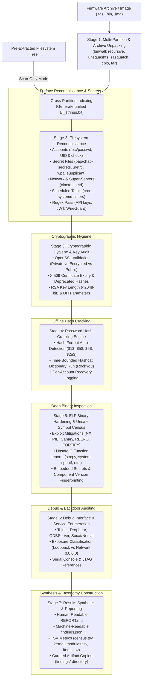

# fw-extract.sh: Embedded Linux Firmware Static Analysis Pipeline

[](https://www.gnu.org/software/bash/)
[](https://en.wikipedia.org/wiki/Linux)
[](https://en.wikipedia.org/wiki/Instruction_set_architecture)
[](https://www.aut.ac.nz)
[](#pipeline-architecture--methodology)
[](LICENSE)

An automated, high-throughput static-analysis pipeline designed to systematically extract, audit, and classify security-critical artifacts from embedded Linux firmware images: **credentials, cryptographic key material, password hashes, binary exploit mitigations, unsafe C function imports, and exposed debug interfaces**.

Developed at **Auckland University of Technology (AUT)** as the operational tooling for Master's thesis research in Cyber Security and Digital Forensics, `fw-extract.sh` bridges the gap between ad-hoc firmware extraction and formal, multi-category vulnerability auditing.

---

## Table of Contents

- [About The Project](#about-the-project)
  - [Academic Research Foundation](#academic-research-foundation)
  - [Motivation: The Firmware Emulation Gap](#motivation-the-firmware-emulation-gap)
  - [Research Questions (RQ1 – RQ3)](#research-questions-rq1--rq3)
- [Pipeline Architecture & Methodology](#pipeline-architecture--methodology)
  - [7-Stage Analysis Flowchart](#7-stage-analysis-flowchart)
  - [Stage Breakdown](#stage-breakdown)
- [Empirical Validation: Alcatel-Lucent Askey 9361 Pilot](#empirical-validation-alcatel-lucent-askey-9361-pilot)
  - [Pilot Target Overview](#pilot-target-overview)
  - [Empirical Findings & Detection Rates](#empirical-findings--detection-rates)
  - [Key Takeaways from the Pilot Study](#key-takeaways-from-the-pilot-study)
- [Core Features & Capabilities](#core-features--capabilities)
- [Installation & Requirements](#installation--requirements)
  - [System Dependencies](#system-dependencies)
  - [Dependency Matrix](#dependency-matrix)
  - [Wordlist Setup for Password Cracking](#wordlist-setup-for-password-cracking)
- [Usage Guide](#usage-guide)
  - [Full Extraction & Analysis](#1-full-extraction--analysis-firmware-archiveimage)
  - [Scan-Only Mode](#2-scan-only-mode-pre-extracted-filesystem)
  - [Configurable Environment Variables](#configurable-environment-variables)
  - [Execution Examples](#execution-examples)
- [Output Taxonomy & Artifacts](#output-taxonomy--artifacts)
  - [Directory Layout](#directory-layout)
  - [Output File Descriptions](#output-file-descriptions)
  - [Machine-Readable Taxonomy (`findings.json`)](#machine-readable-taxonomy-findingsjson)
- [Research Scope & Limitations](#research-scope--limitations)
- [Ethical Considerations & Responsible Disclosure](#ethical-considerations--responsible-disclosure)
- [Repository File Inventory](#repository-file-inventory)
- [Citation](#citation)
- [License](#license)

---

## About The Project

### Academic Research Foundation

`fw-extract.sh` was conceptualized and developed by **Mohammad Mosfaqur Rahman** as part of the Master of Cyber Security and Digital Forensics research project at **Auckland University of Technology (AUT)**, supervised by **Dr. Alastair Nisbet**:

> **Title:** *The Systematic Extraction of Sensitive Information from Embedded Linux Firmware Images Using Static Analysis Techniques*  
> **Institution:** School of Engineering, Computer and Mathematical Sciences, Auckland University of Technology, New Zealand  
> **Degree:** Master of Cyber Security and Digital Forensics (STEM Research Project)

### Motivation: The Firmware Emulation Gap

Empirical firmware research demonstrates that over **90% of embedded Linux firmware images lack source code and fail dynamic emulation** in frameworks such as QEMU or FIRMADYNE, due to proprietary System-on-Chip (SoC) peripheral dependencies, missing hardware timers, and custom ASIC interfaces (Cheng et al., 2018). Consequently, static analysis is the only viable primary analysis method across large-scale, heterogeneous firmware corpora.

However, existing open-source static analysis utilities exhibit a systemic limitation: **no prior research design comprehensively evaluated detection rates and precision across all five critical sensitive-information categories simultaneously against an empirically verified, cross-partition manual ground-truth baseline**.

`fw-extract.sh` addresses this exact gap by providing an end-to-end, reproducible pipeline that measures and audits:
1. **User Accounts & Hardcoded Credentials** (root-equivalents, shadow hashes, API keys, tokens)
2. **Cryptographic Key Material** (plaintext vs. passphrase-protected private keys, public keys, certificates)
3. **Password Hashes & Cracking Feasibility** (crypt algorithm identification and time-bounded dictionary attacks)
4. **Binary Hardening Deficits & Unsafe C Imports** (canary, PIE, NX, RELRO, FORTIFY_SOURCE, unsafe libc calls)
5. **Debug Interfaces & Backdoors** (telnet, dropbear, gdbserver, JTAG, serial consoles, local vs. network exposure)

### Research Questions (RQ1 – RQ3)

The pipeline is explicitly structured to provide quantitative answers to three core research questions:

| Research Question | Focus Area | Pipeline Mechanism |
|---|---|---|
| **RQ1: Multi-Category Detection Coverage** | *How effectively does static analysis extract sensitive information across multiple vulnerability categories in embedded Linux firmware images?* | Quantifies automated detection rates and precision across all 5 sensitive categories against a manual cross-partition baseline. |
| **RQ2: Plaintext Cryptographic Key Exposure** | *What proportion of cryptographic key material in embedded Linux firmware is stored without passphrase protection?* | Programmatically validates private keys via `openssl` to determine the exact ratio of unprotected plaintext keys to passphrase-encrypted keys. |
| **RQ3: Binary Hardening & Unsafe Call Sites** | *To what extent do open-source static analysis tools identify unsafe function call sites in compiled ELF binaries extracted from production firmware?* | Extracts binary dynamic symbol tables (`readelf -s`) and string indices to audit unsafe calls (`strcpy`, `system`, `gets`, etc.) alongside modern exploit mitigations. |

---

## Pipeline Architecture & Methodology

### 7-Stage Analysis Flowchart



### Stage Breakdown

1. **Stage 1: Firmware Acquisition & Multi-Partition Unpacking**
   - Verifies file integrity (`sha256sum`) and identifies MIME type.
   - Executes recursive `binwalk` (depth 5), `unsquashfs` / `sasquatch` for SquashFS partitions, and `cpio` extraction.
   - Performs multi-pass recursive unpacking of nested filesystem archives (`.tgz`, `.tar`, `.zip`, `.xz`, `.squashfs`).
   - Compiles a unified, deduplicated cross-partition string repository (`all_strings.txt`).

2. **Stage 2: Filesystem Reconnaissance & Credential Audit**
   - **Account Audit:** Parses `/etc/passwd` to flag non-root accounts granted root privileges (UID 0), accounts with blank passwords, and active shells (`/bin/sh`, `/bin/bash`).
   - **Password Hash Enumeration:** Extracts password hashes from `/etc/shadow`, `/etc/shadow.bak`, and `/etc/shadow.dir/shadow`.
   - **Dedicated Secret Stores:** Discovers plaintext secret files (`pap-secrets`, `chap-secrets`, `eap.secret`, `*.secret*`, `.netrc`, `.htpasswd`, wireless configurations like `wpa_supplicant.conf` and `hostapd.conf`, and RADIUS configs).
   - **Network & Super-Servers:** Parses `xinetd` and `inetd` configurations to report background daemons running under UID 0, flagging dynamic command execution (`eval`, `exec`).
   - **Scheduled Tasks:** Audits crontabs (`/etc/cron*`, `/var/spool/cron*`) and systemd timers running under root.
   - **Cross-Partition Regex Scan:** Scans `all_strings.txt` for high-entropy secrets, including Google API keys, GitHub tokens, JWTs, and WireGuard keys.

3. **Stage 3: Cryptographic Hygiene & Key Material Classification (RQ2)**
   - Discovers all private keys, public keys, and certificates across the entire filesystem tree.
   - Programmatically validates key headers and decryptability via `openssl` commands, classifying each into:
     - **Private (Plaintext):** Stored unencrypted with no passphrase required.
     - **Private (Encrypted):** Passphrase-protected (requiring decryption password).
     - **Public:** Public keys and OpenSSH authorized keys.
   - Validates X.509 certificates: extracts Subject, Issuer, expiration dates (flags expired certs), weak signature algorithms (MD5, SHA-1), and self-signed status.
   - Flags cryptographically weak RSA key lengths (< 2048-bit) and weak Diffie-Hellman parameters (`dhpars.pem`).

4. **Stage 4: Password Hash Cracking Engine**
   - Auto-detects extracted hash types:
     - MD5-crypt (`$1$`) &rarr; Hashcat mode `500`
     - SHA-256-crypt (`$5$`) &rarr; Hashcat mode `7400`
     - SHA-512-crypt (`$6$`) &rarr; Hashcat mode `1800`
     - Blowfish/bcrypt (`$2a$`, `$2b$`, `$2y$`) &rarr; Hashcat mode `3200`
   - Executes time-bounded dictionary attacks against user-provided wordlists (e.g., `rockyou.txt`) with strict process management (`HASH_TIMEOUT`).
   - Logs recovered credentials and per-account cracking success metrics.

5. **Stage 5: ELF Binary Hardening & Unsafe Symbol Census (RQ3)**
   - Catalogs all compiled ELF binaries across all extracted partitions.
   - Evaluates exploit mitigation flags:
     - **Stack Canaries:** Detects `__stack_chk_fail` symbol imports.
     - **Executable Space Protection (NX):** Inspects `GNU_STACK` ELF program headers.
     - **Position Independent Executable (PIE):** Checks `ET_DYN` vs. `ET_EXEC`.
     - **Read-Only Relocations (RELRO):** Differentiates `Full RELRO`, `Partial RELRO`, and `No RELRO`.
     - **FORTIFY_SOURCE:** Identifies compiler buffer-overflow protection wrappers (`*_chk` libc imports).
   - **Unsafe C Function Import Census:** Scans dynamic symbol tables (`readelf -s`) and per-binary strings for dangerous C functions: `system`, `popen`, `execve`, `strcpy`, `strcat`, `sprintf`, `vsprintf`, `gets`.
   - **Embedded Secret Attribution:** Deep-scans the top largest binaries (configurable via `BIN_SCAN_LIMIT`) for embedded private key headers, certificates, API tokens, and URLs.
   - **Component Version Fingerprinting:** Identifies version strings for embedded software packages (OpenSSL, BusyBox, glibc, Dropbear, libcurl, uhttpd, strongSwan, etc.).

6. **Stage 6: Debug Interfaces & Backdoor Enumeration**
   - Audits initialization scripts (`/etc/init.d/*`, `/etc/rc.local`, `rcS`), user profiles, and shell scripts.
   - Identifies references to `telnet`, `telnetd`, `dropbear`, `gdbserver`, `socat`, `nc -l`, and serial consoles (`/dev/ttyS*`, `/dev/console`).
   - Categorizes service exposures:
     - **Local / Loopback-Exposed:** Bound exclusively to `127.0.0.1`.
     - **Network-Exposed:** Bound to `0.0.0.0` or external network interfaces.
   - Detects hardware JTAG references and test-mode environment flags.

7. **Stage 7: Results Synthesis & Structured Taxonomy Construction**
   - Compiles findings into an exhaustive human-readable report: `REPORT.md`.
   - Emits a standardized, machine-readable JSON taxonomy: `findings.json`.
   - Produces tabular datasets: `census.tsv`, `kernel_modules.tsv`, and `items.tsv`.
   - Curates and copies all security-relevant files into provenance-preserving folders under `findings/`.

---

## Empirical Validation: Alcatel-Lucent Askey 9361 Pilot

### Pilot Target Overview

The pipeline was empirically validated on a production telecommunications firmware image from an **Alcatel-Lucent Askey 9361 3G Femtocell** (low-power W-CDMA / HSPA+ home cell, Broadcom BCM61600KFB1G MIPS SoC, NAND flash).

- **Firmware Image:** `BSR-04.03.70.a.2.aky.tgz`
- **Compressed Size:** 125,376,373 bytes (~120 MB)
- **SHA-256 Digest:** `cbc566a4be3491a8f2ae0dc9df97a0ade4ef9e223af696415bdb463ff966b1be`
- **Target Architecture:** MIPS (Big Endian)

### Empirical Findings & Detection Rates

| Category / Finding | Manual Baseline | Automated (`fw-extract.sh`) | Detection Rate | Classification / Risk |
|---|:---:|:---:|:---:|---|
| **Root-Equivalent Accounts (UID 0)** | 3 | 3 | **100%** | `femtoAdmin`, `factoryAdmin`, `localAdmin` (High) |
| **Password Hashes ($1$ MD5-crypt)** | 4 | 4 | **100%** | `/etc/shadow.dir/shadow` (High) |
| **Hardcoded Script Secrets** | 2 | 2 | **100%** | `RADIUS_SECRET` in `/etc/init.d/radius`, `eap.secret` (High) |
| **Application Partition Credentials** | 0 *(missed)* | 1 | **>100%** | `fbsrpass` TR-069 cred in `fpu1.vx` (High) |
| **Private Keys (Plaintext)** | 2 | 2 | **100%** | `dummy.key` (RSA 2048), `id_dsa` (RSA 1024) (Critical) |
| **Private Keys (Encrypted)** | 0 | 0 | **100%** | **0% passphrase protected** (RQ2 answered) |
| **Public Keys** | 2 | 2 | **100%** | `lab.pub`, `id_dsa.pub` (Informational) |
| **X.509 Certificates** | 1 | 1 | **100%** | Expired (2009), deprecated SHA-1 hash (Medium) |
| **Insecure SSH Server Configurations** | 1 | 1 | **100%** | `AuthorizedKeysFile /tmp/authorized_keys` (High) |
| **ELF Binaries Analysed** | 374 | 374 | **100%** | Comprehensive binary census |
| **ELF Binaries Missing Stack Canary** | 374 | 374 | **100%** | 100% of binaries lack stack protection |
| **ELF Binaries Missing Full RELRO** | 373 | 373 | **100%** | 99.7% of binaries lack full RELRO |
| **ELF Binaries Importing Unsafe Functions** | 94 | 94 | **100%** | `system`, `strcpy`, `sprintf`, `execve`, etc. |
| **Loadable Kernel Modules (.ko)** | 63 | 63 | **100%** | Driver inventory, vermagic, and parameters |
| **Debug Consoles / Services** | 6 | 6 | **100%** | Telnet on localhost:3140 and localhost:7900 |

#### Cross-Firmware Comparative Benchmark

The pipeline was also evaluated across multiple distinct telecommunications firmware architectures in the testbed, contrasting the **Askey 9361 Femtocell** against the **SmartNode 532 Femtocell** (`532-256-V8.4n`):

| Evaluation Metric | Alcatel-Lucent Askey 9361 (`BSR-04.03.70`) | SmartNode 532 (`532-256-V8.4n`) |
|---|:---:|:---:|
| **Firmware Archive Size** | 120 MB | 6.5 MB |
| **Extracted Files Count** | 2,117 files | 131 files |
| **Indexed String Tokens** | 1,236,616 strings | 286,965 strings |
| **Plaintext Private Keys** | 2 (`dummy.key`, `id_dsa`) | 1 (`prikey.pem`) |
| **Encrypted Private Keys** | 0 | 1 (embedded decompressed) |
| **X.509 Certificates** | 1 (expired 2009, SHA-1) | 2 (expired easy-rsa `ca.crt`, `dhpars.pem`) |
| **Crackable Hashes in Shadow** | 4 ($1$ MD5-crypt) | 0 |
| **ELF Binaries Analysed** | 374 | 51 |
| **Binaries Lacking Canaries** | 374 (100%) | 51 (100%) |
| **Binaries with Unsafe C Imports** | 94 (25.1%) | 34 (66.7%) |
| **Unstripped Binaries** | 6 (1.6%) | 43 (84.3%) |
| **Hardware / FPGA Bitstream Blobs** | 0 | 4 (.rbf / coprocessor bitstreams) |
| **Kernel Modules Cataloged** | 63 | 7 |

### Key Takeaways from the Pilot Study

1. **100% Unencrypted Private Key Storage (RQ2):** Both private keys recovered from the production image (`dummy.key` and `id_dsa`) were stored in unencrypted plaintext. Any adversary with access to the published firmware possesses the private keys directly.
2. **Cryptographically Deprecated 1024-bit RSA:** The key file `id_dsa` was misnamed (DSA extension), but OpenSSL inspection proved it was actually an RSA 1024-bit key, considered cryptographically weak by NIST standards.
3. **Severe Privilege Escalation Vector:** The SSH daemon configuration explicitly designated `/tmp/authorized_keys` as the authorized keys file. Because `/tmp` is a world-writable path in embedded Linux, any local unprivileged process can write an SSH key and achieve instantaneous root authentication.
4. **Complete Absence of Binary Mitigations (RQ3):** Out of 374 compiled ELF binaries, 100% lacked stack canaries and 94 imported vulnerable C library functions, exposing the device to trivial memory corruption and buffer-overflow exploitation.
5. **Cross-Partition Supremacy:** Automated cross-partition string indexing recovered sensitive TR-069 credentials from the secondary application partition (`fpu1.vx`) that manual analysis constrained to the rootfs had overlooked.

---

## Core Features & Capabilities

```
+-----------------------------------------------------------------------------------+
|                            fw-extract.sh CAPABILITIES                             |
+-----------------------------------------------------------------------------------+
|  [Filesystem Unpacking]     [Cryptographic Hygiene]    [Binary Security Census]  |
|  - binwalk recursive (d=5)  - OpenSSL key validation   - Stack Canary detection  |
|  - unsquashfs / sasquatch   - Plain vs Encrypted ratio - NX (GNU_STACK) checking |
|  - cpio / tar / tgz / zip   - X.509 expiry & algorithm - PIE (ET_DYN vs ET_EXEC) |
|  - Multi-partition dedup    - Weak RSA (<2048) & DH    - RELRO depth resolution  |
|                                                        - FORTIFY_SOURCE audit    |
|  [Credential Discovery]     [Password Hash Cracking]   - Unsafe libc imports     |
|  - UID 0 account audit      - MD5-crypt ($1$)          - Embedded secrets in ELF |
|  - /etc/shadow extraction   - SHA-256 ($5$) / 512 ($6) - Version fingerprinting  |
|  - pap/chap-secrets, .netrc - Blowfish ($2a/$2b/$2y)                             |
|  - wpa_supplicant / hostapd - Hashcat automation       [Kernel & Hardware]       |
|  - RADIUS & EAP secrets     - Time-budgeted dictionary - Kernel module (.ko) inv |
|  - API keys, JWT, WireGuard                            - Driver param extraction |
|                                                        - SUID / SGID audit       |
|  [Debug & Backdoors]        [Deterministic Reporting]  - World-writable check    |
|  - telnet / telnetd audit   - Human-readable REPORT.md - U-Boot MTD environment  |
|  - dropbear / gdbserver     - Machine findings.json    - FPGA bitstream discovery|
|  - Loopback vs Network      - Granular TSV spreadsheets- Sysctl hardening audit  |
+-----------------------------------------------------------------------------------+
```

---

## Installation & Requirements

### System Dependencies

`fw-extract.sh` is written in POSIX/Bash 4+ and relies primarily on standard Unix command-line utilities and established security tools.

#### Debian / Ubuntu / Kali Linux:

```bash
sudo apt-get update
sudo apt-get install -y \
    binwalk \
    squashfs-tools \
    binutils \
    openssl \
    file \
    findutils \
    grep \
    coreutils \
    python3 \
    hashcat
```

*Note on non-standard SquashFS:* For legacy or vendor-modified SquashFS images (common in MIPS/Broadcom devices), install [`sasquatch`](https://github.com/devttys0/sasquatch):

```bash
sudo apt-get install -y build-essential liblzma-dev liblzo2-dev zlib1g-dev
git clone https://github.com/devttys0/sasquatch.git
cd sasquatch && ./build.sh && sudo make install
```

#### Arch Linux:

```bash
sudo pacman -S binwalk squashfs-tools binutils openssl file grep hashcat python
```

### Dependency Matrix

| Tool | Category | Status | Operational Purpose |
|---|---|:---:|---|
| `binwalk` | Extraction | **Required** | Signature scanning and firmware archive carving |
| `unsquashfs` / `sasquatch` | Extraction | **Required** | Decompressing SquashFS root and application filesystems |
| `readelf` | Binary Audit | **Required** | Inspecting ELF headers, dynamic symbol tables, and program segments |
| `openssl` | Cryptography | **Required** | Validating cryptographic keys, RSA bit lengths, and X.509 certs |
| `file`, `strings`, `grep`, `find` | Reconnaissance | **Required** | Filesystem discovery, MIME classification, and string indexing |
| `numfmt`, `tr`, `sed`, `awk` | Text Processing | **Required** | Metric aggregation and report formatting |
| `modinfo` | Kernel Audit | *Optional* | Extracting kernel driver parameters and author metadata *(falls back to strings)* |
| `hashcat` | Password Cracking | *Optional* | Automated dictionary attacks against extracted hashes |
| `python3` | Reporting | *Optional* | Emitting validated, machine-readable `findings.json` |

### Wordlist Setup for Password Cracking

Stage 4 password cracking is automatically executed when a wordlist is supplied. To use the standard `rockyou.txt` wordlist:

```bash
# Decompress standard rockyou wordlist if present on system
gzip -dc /usr/share/wordlists/rockyou.txt.gz > ./rockyou.txt 2>/dev/null || true
```

---

## Usage Guide

Ensure `fw-extract.sh` has executable permissions:

```bash
chmod +x fw-extract.sh
```

### 1. Full Extraction & Analysis (Firmware Archive/Image)

Processes a raw compressed firmware archive or binary image from scratch, running all 7 stages:

```bash
./fw-extract.sh <firmware_archive_or_binary> [output_directory]
```

**Example:**
```bash
./fw-extract.sh BSR-04.03.70.a.2.aky.tgz out_bsr/
```

### 2. Scan-Only Mode (Pre-Extracted Filesystem)

If the filesystem has already been extracted, passing a directory path directly skips Stage 1 unpacking and runs immediate security auditing across Stages 2 through 7:

```bash
./fw-extract.sh /path/to/extracted/rootfs/ out_scan/
```

### Configurable Environment Variables

Fine-tune pipeline execution using standard environment variables:

| Variable | Default | Description |
|---|:---:|---|
| `HASH_WORDLIST` | *None* | Path to password dictionary (e.g., `./rockyou.txt`). Cracking stage is skipped if omitted. |
| `HASH_TIMEOUT` | `3600` | Maximum time budget in seconds allocated for the `hashcat` execution. |
| `NO_HASHCAT` | `0` | Set to `1` to force-disable password cracking even if `HASH_WORDLIST` is specified. |
| `BIN_SCAN_LIMIT` | `200` | Number of largest ELF binaries audited for embedded secrets and component versions. |

### Execution Examples

#### Running with 24-Hour Hashcat Dictionary Attack:
```bash
HASH_WORDLIST=./rockyou.txt HASH_TIMEOUT=86400 ./fw-extract.sh BSR-04.03.70.a.2.aky.tgz out_crack/
```

#### Running Deep Binary Scan on Top 500 Largest Executables:
```bash
BIN_SCAN_LIMIT=500 ./fw-extract.sh /path/to/extracted_rootfs/ out_deep/
```

---

## Output Taxonomy & Artifacts

### Directory Layout

Every run produces a deterministic, self-contained output directory:

```
out_bsr/
├── REPORT.md                  # Comprehensive human-readable assessment report
├── findings.json              # Standardized machine-readable taxonomy
├── items.tsv                  # Granular findings log with severity ratings
├── census.tsv                 # Per-ELF binary hardening metrics and unsafe call counts
├── kernel_modules.tsv         # Complete loadable kernel driver inventory
├── all_strings.txt            # Cross-partition unified string index
├── binwalk_scan.txt           # Raw Stage 1 binwalk extraction log
├── hashcat.log / .pot         # Stage 4 cracking logs and cracked hash potfile (if enabled)
└── findings/                  # Curated repository of copied security artifacts
    ├── certs/                 # X.509 certificates and IPsec secrets
    ├── configs/               # SSH, xinetd, sysctl, and U-Boot config files
    ├── credentials/           # Discovered plaintext passwords and API keys
    ├── hashes/                # Extracted shadow hashes and crackable.txt
    ├── keys/                  # Plaintext private keys and public keys
    └── modules/               # Suspicious or proprietary kernel modules
```

### Output File Descriptions

- **`REPORT.md`**: Executive markdown report with full analysis details: extraction metrics, account census, cryptographic hygiene ratings, binary mitigation tables, driver inventory, and summary statistics.
- **`findings.json`**: Structured JSON containing firmware metadata, aggregate metric counters, and an array of typed findings with file paths, severity ratings, and descriptions.
- **`census.tsv`**: Tab-separated matrix detailing every compiled ELF binary:
  `[RELRO status] \t [File Size] \t [Architecture] \t [Linkage] \t [Stripped] \t [FORTIFY] \t [Unsafe Symbols] \t [Path]`
- **`kernel_modules.tsv`**: Tab-separated catalog of all `.ko` drivers:
  `[Module Name] \t [License] \t [Vermagic] \t [Author / Description] \t [Parameters] \t [Path]`
- **`items.tsv`**: Tab-separated security events:
  `[Category] \t [Severity] \t [File Path] \t [Detail]`

### Machine-Readable Taxonomy (`findings.json`)

`findings.json` allows easy integration into CI/CD pipelines, DevSecOps platforms, and SIEM environments:

```json
{
  "tool": "fw-extract.sh v2.2.0",
  "firmware": {
    "name": "BSR-04.03.70.a.2.aky.tgz",
    "size": 125376373,
    "sha256": "cbc566a4be3491a8f2ae0dc9df97a0ade4ef9e223af696415bdb463ff966b1be"
  },
  "summary": {
    "private keys (plaintext)": 2,
    "private keys (encrypted)": 0,
    "public keys": 2,
    "crackable hashes": 4,
    "ELF binaries analysed": 374,
    "ELF binaries missing hardening": 374,
    "ELF binaries importing unsafe fn": 94,
    "SUID binaries": 2,
    "kernel modules (.ko) cataloged": 63,
    "world-writable files (system paths)": 1
  },
  "findings": [
    {
      "category": "key",
      "severity": "high",
      "path": "squashfs_rootfs_V3_EC_L5.4.3.70.a.0003/etc/init.d/dummy.key",
      "detail": "plaintext private key (RSA 2048 bit)"
    },
    {
      "category": "ssh_config",
      "severity": "high",
      "path": "squashfs_rootfs_V3_EC_L5.4.3.70.a.0003/etc/ssh/sshd_config2",
      "detail": "insecure AuthorizedKeysFile in temp path: /tmp/authorized_keys"
    }
  ]
}
```

---

## Research Scope & Limitations

### In-Scope
- Static inspection of filesystem hierarchies, configuration files, and initialization scripts.
- Architecture-agnostic cryptographic key validation and password-hash cracking.
- Dynamic symbol table auditing and exploit mitigation analysis of compiled ELF binaries across MIPS, ARM, ARM64, and x86 architectures.
- Cross-partition artifact correlation and deduplication.

### Out-of-Scope / Exclusions
In accordance with the formal research design:
- **Dynamic Analysis / Emulation:** Excluded due to systemic peripheral emulation bottlenecks in IoT/telecom firmware (Cheng et al., 2018).
- **Active Network Interception:** No devices are powered on or connected to live communication networks.
- **Physical Hardware Exploitation:** JTAG fault injection, chip desoldering, and side-channel power analysis are outside the static analysis scope.

---

## Ethical Considerations & Responsible Disclosure

This tool and the associated research strictly adhere to academic and industry ethical standards:

1. **Non-Invasive Research:** All analyses are conducted offline on firmware images acquired from legitimate vendor sources or authorized research devices. No live network services are probed.
2. **Responsible Disclosure:** Any systemic, unpatched vulnerabilities identified in active product lines are reported through standard responsible disclosure channels prior to public dissemination.
3. **Data Redaction:** Sensitive findings presented in public documentation, academic papers, or shared artifacts are appropriately redacted.
4. **Authorized Use Only:** `fw-extract.sh` is provided for security researchers, firmware auditors, penetration testers, and device manufacturers to evaluate and harden systems they are legally authorized to inspect.

---

## Repository File Inventory

| File / Directory | Description |
|---|---|
| [`fw-extract.sh`](fw-extract.sh) | **Main operational script (v2.2):** Full 7-stage automated static analysis pipeline. |
| [`fw-extract.v1.sh`](fw-extract.v1.sh) | Legacy v1.0 prototype script retained for historical reference and diff analysis. |
| [`Final_STEM_Rahman_v12.pdf`](Final_STEM_Rahman_v12.pdf) | Academic research report submitted for Master of Cyber Security and Digital Forensics at AUT. |
| [`Final_STEM_Rahman_v12.docx`](Final_STEM_Rahman_v12.docx) | Word source document of the research report. |
| `BSR-04.03.70.a.2.aky.tgz` | Reference firmware image: Alcatel-Lucent Askey 9361 3G Femtocell (~120 MB; local benchmark image). |
| `analysis_bsr/` | Benchmark analysis results, TSVs, and reports for the Askey 9361 firmware. |
| [`hashes_only.txt`](hashes_only.txt) | Extracted password hashes benchmark file. |
| [`LICENSE`](LICENSE) | MIT License terms. |

---

## Citation

If you use `fw-extract.sh` or reference the empirical findings in academic research, security audits, or publications, please cite:

```bibtex
@mastersthesis{rahman2026systematic,
  author    = {Mohammad Mosfaqur Rahman},
  title     = {The Systematic Extraction of Sensitive Information from Embedded Linux Firmware Images Using Static Analysis Techniques},
  school    = {School of Engineering, Computer and Mathematical Sciences, Auckland University of Technology},
  year      = {2026},
  address   = {Auckland, New Zealand},
  type      = {Master of Cyber Security and Digital Forensics Research Project},
  note      = {Supervised by Dr. Alastair Nisbet}
}
```

---

## License

This project is licensed under the [MIT License](LICENSE) &copy; 2026 Mohammad Mosfaqur Rahman.
